# 持续集成

> 持续集成模块有 5 种资源组成，分别是 PipelineResource,Task,Task-Run,Pipeline,Pipeline-Run 组成，下面会针对这五种资源进行详细的讲解并且怎么创建的。

## PipelineResource 资源简介

> PipelineResource 是 pipeline 中的一组对象，这些对象可以用于 task 的 input（输入）和 outoput（ 输出）,Pipeline-resoure 目前支持两种类型（git 和 image）, 一个 task(任务)可以有一个或者多个 input(输入)和 output(输出)。

#### 举个栗子：

- 一个 task 的 input 可以是一个 github/gitlab/gitea 地址。
- 一个 task 的 output 可以是一个 image(镜像)。
- 一个 task 的 output 可以输出一个 jar 包,golang 的二进制文件，dotnet 的二进制文件，rust 的二进制执行程序等。

### Pipeline-resourece 的创建


创建名称为`fuxi-image`的资源并且类型是 image 类型的。params 是一个 name 与 value 的。上图是 key 是`url`,value 是 harbor 的地址`harbor.compass.ym/arch/fuxi-test-push-base:v0.0.1`。 <br>

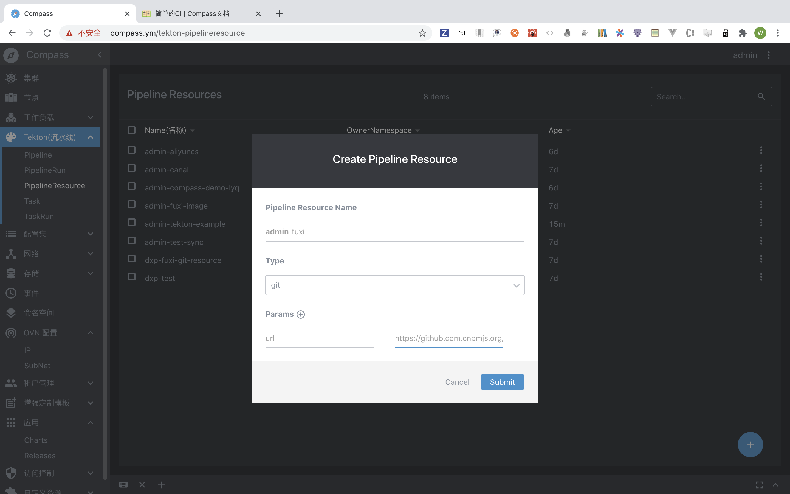

创建名称为`fuxi`的资源并且类型是 git 类型的。params 是一个 key 与 value 的。上图是 name 是`url`,value 是 harbor 的地址`https://github.com.cnpmjs.org/yametech/fuxi`。默认是拉去 master 的代码，如果你要指定分支构建你就得需要增加一个 param 了，name 一定`revision` ,value 是`dev`或者 `master`,这个 value 就是你的分支名称<br>

## Task 资源简介

> 一个 task 代表这一次任务，task 里面可以配置多个 step(多个步骤)。step 按照你配置的顺序执行。一个做完才到下一个，如果一个 step 出现了错误，后面的步骤将不会执行。也没必要执行。

task 在 pipeline 图里面创建，下方 pipeline 会讲解到。

## pipeline 资源简介

> 一个 pipeline 可以包含多个 task，定义你的执行顺序，按照你的 task 的顺序执行 task，也可以支持并行 task。

举个栗子：

```
        |            |
        v            v
     test-app    lint-repo
    /        \
   v          v
build-app  build-frontend
   \          /
    v        v
    deploy-all

```

> 为啥会有并行 task？就用上图的说以下，比如一个大项目，有些开发的同学，就会有在一个大 repo 里面放自己的前端代码和后台代码，比如用 frontend 和 backend 这两个文件夹，这样子在跑 pipeline 的时候，用户自己需要跑前端和后端的代码的 ci，都验证是否有文件没提交的代码文件或者错误的代码文件。

## Pipeline 资源的创建

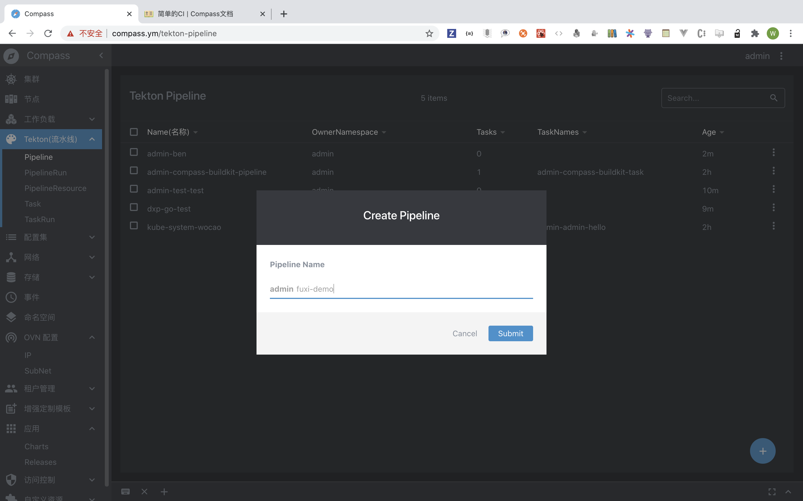

> 在 pipeline 有个加号，点击加号进行创建一个 pipeline，并给其 pipeline 起上名称。此处用的`fuxi-demo`

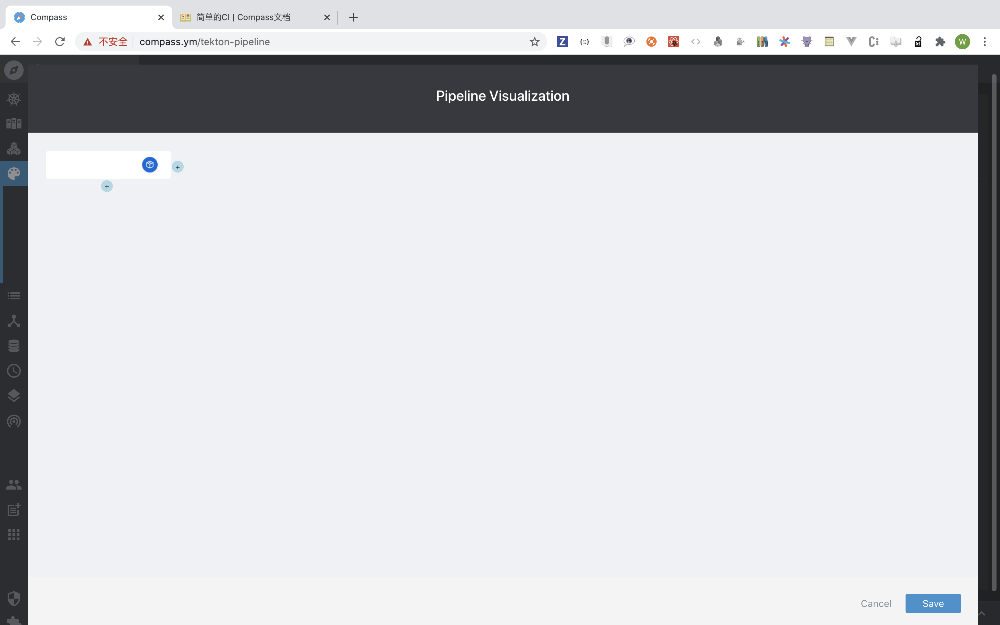

> 创建完该 pipeline 后点击 pipeline 的条目，就能产生一个这个 pipeline 的 dialog，自己绘制自己的流水线。

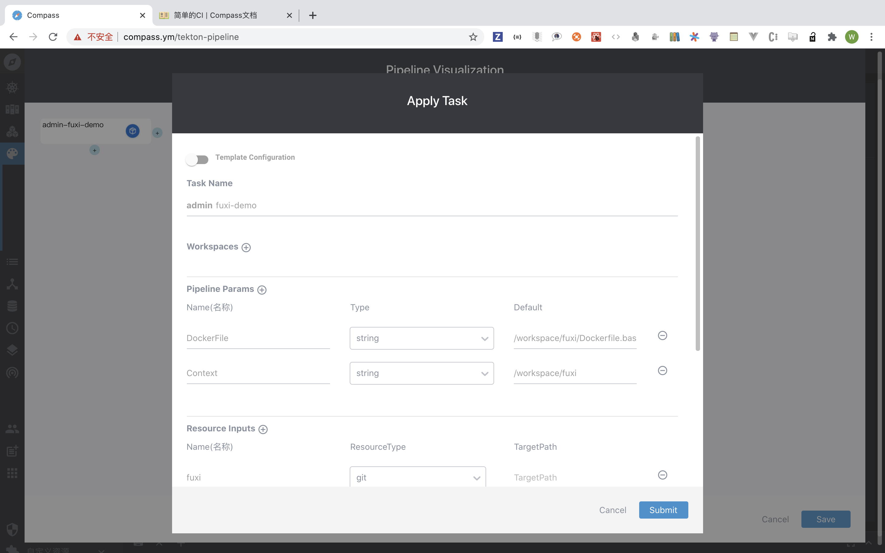

> 点击空白的 node，这里的 node 概念也是属于一个 task 的概念。点击的 node 时候编辑 task。此处用创建名称为`fuxi-demo`的任务。此 task 的 params，是用来简化操作的，可以用来定一个变量，这个变量类似代码的变量，一处定义，处处使用。可复用的作用。此处的 input 资源，名称为`fuxi`表示你克隆下来的代码，就存取到`/workspace/fuxi`这个目录下面。

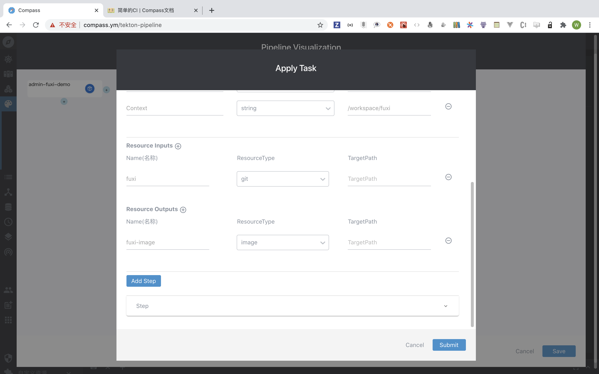

> 前面说到的，一个任务的可以有输入和输出，那么输入就是一个 image，此处名称为`fuxi-image`。为 image 类型的资源输出。

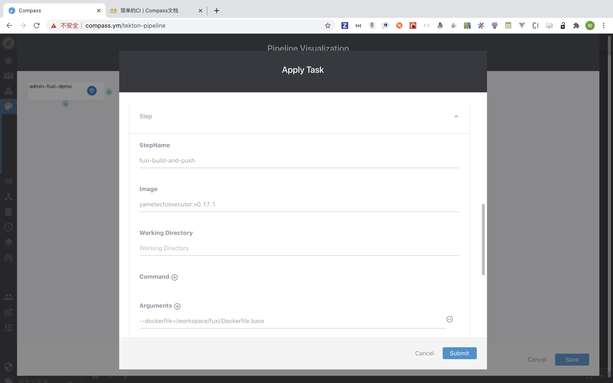

> 此处配置我们的 task 里面的 Step，Step 的定义是你想做什么事情，怎么去做，比如这里用的是名称随便起，但是一个 task 里面的 step 名称不能重复即可，Step 里面有个 image 的名称`yametech/excutor:v0.17.1`,表示用的这个 runtime 构建你的代码。根据 dockerfile 去构建，并且推送到相应的镜像 register。


> 此处的一些参数是根据当前`yametech/excutor:v0.17.1`所需要的的一些参数和环境变量。

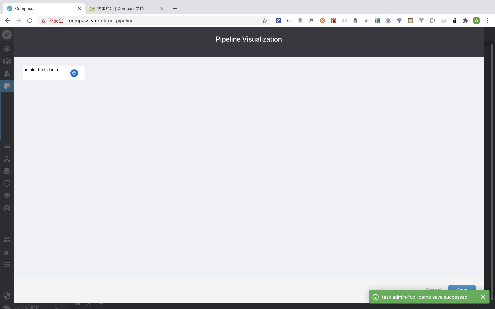

> 提交保存后的，就把 task 编辑并且保存好了，这个 task 可以复用。定义一次，下次继续使用。

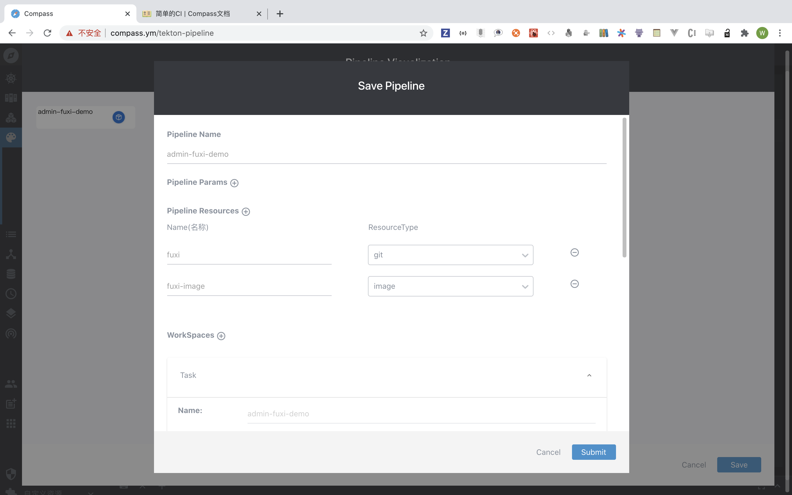

> 点击`save`的时候需要填写一些 pipeline 的参数，你需要定义 pipeline 的参数，把它传入 task 这个资源里面(因为 task 里面你要求传入 2 个 resource 的参数，一个是 input 和 output 的参数)，所以在 pipeline 也声明传入此 task 函数。

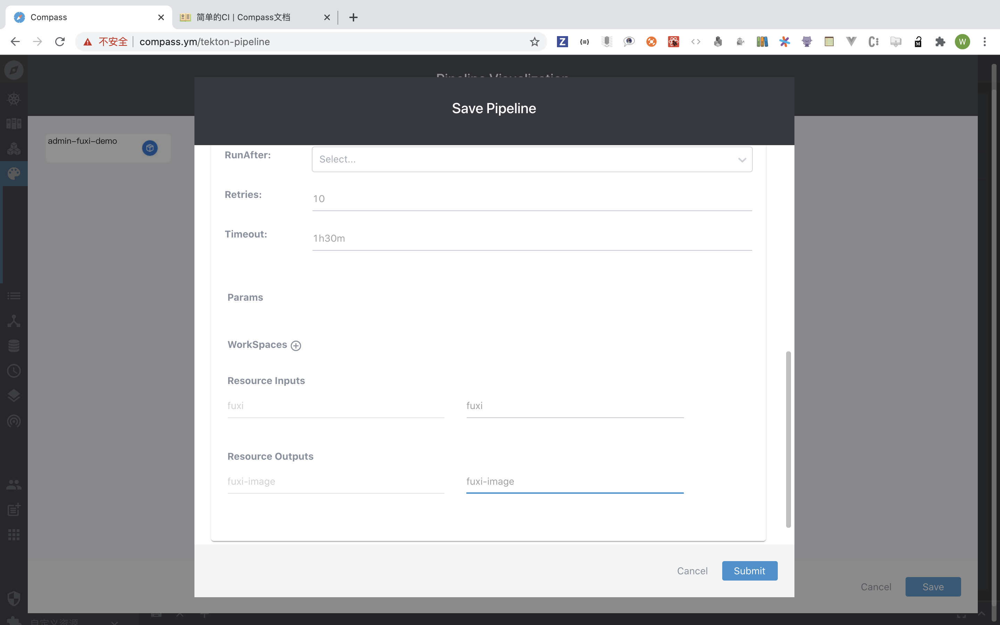

> 把在 pipeline 定义的参数，传入 task 里面去。点击保存即可。这里有点抽象。你可以把一个 task 想像为一个代码里面的一个 function(函数)，而这个函数的参数需要两个参数一个是 input 和一个 output。那么你要调用这个函数，就需要传入这两个参数。pipeline 想像成一个大函数，调用 task 这小函数，并且需要在 pipeline 里面声明传入。这样子是不是就很好理解了。并且可以配置这个 task 的重试次数`Retries`,若不设置，就会不断重试，不建议这样子。最好设置 3 次即可。超时时间，`timeout`字段，格式为`1h`,`1h30m`,`1h30m30s`。这是超时时间的设置格式。

用 golang 为代码表示为如下：

```
func task1(inputs,outputs Resource) {}
func task2(inputs,outputs Resource) {}
func task3(inputs,outputs Resource) {}
func pipeline(inputs,outputs Resource){
    task1(inputs,outputs);
    task2(inputs,outputs);
    task3(inputs,outputs);
}

func pipeineRun(){
    var inputs,outputs Resource
    inputs="git"
    outputs="image"
    pipeline(inputs,outputs)
}

func main(){
    pipeineRun()
}

```

以上是不是就很好理解了？ 不理解你来打我。

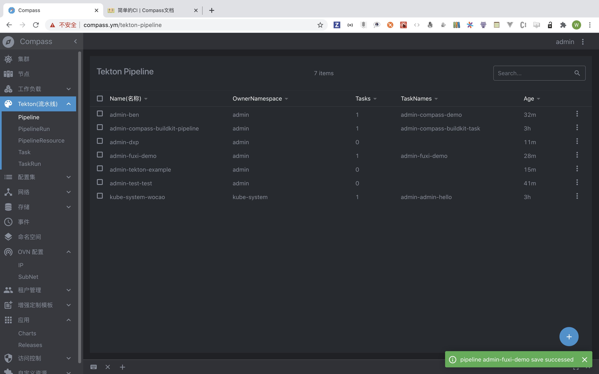

> 保存后的状态。

## PipelineRun 资源简介

> 一个 pipelierun 允许你指定并执行你定义的 pipeline，并且按照你 pipeline 定义的任务按顺序执行。

### 跑起一个 pipeline

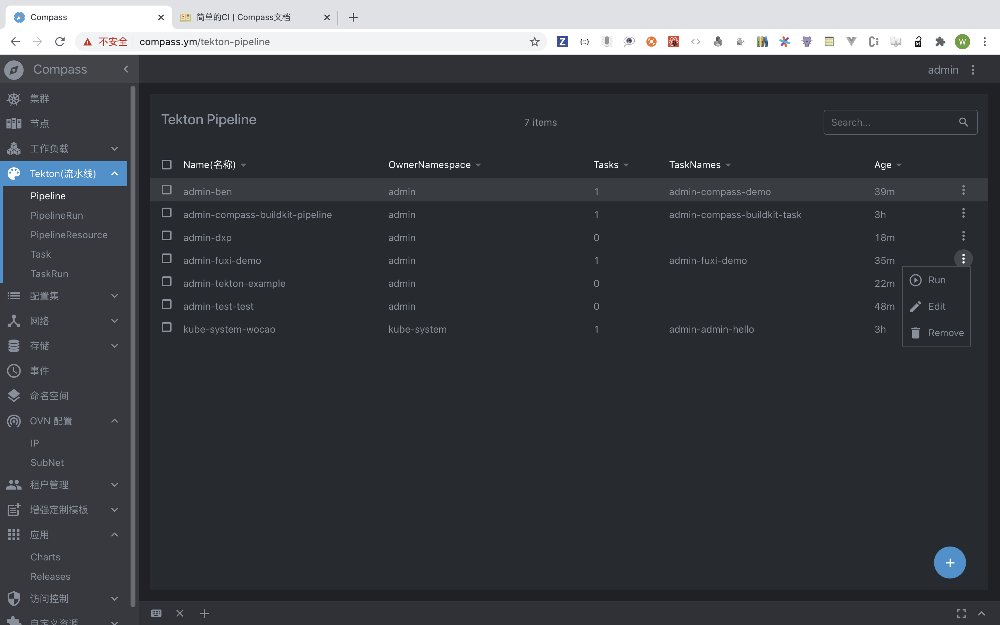

> 在当前的 pipeline 上点击菜单，点击 Run 配置 run 的参数。

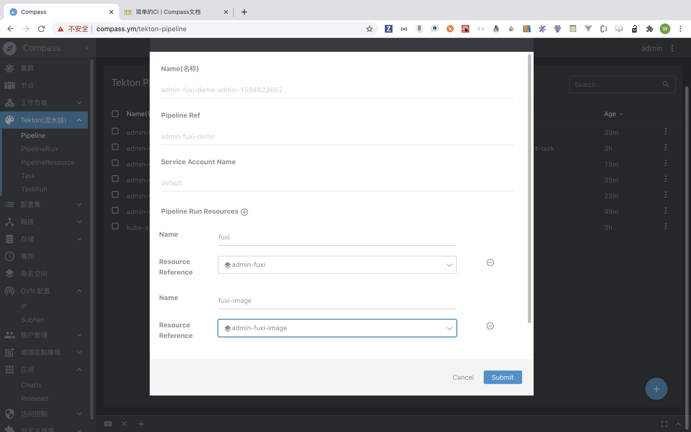

> 这里的 pipeline-run 就像我上面说的顶级函数。把 pipeline 的实例传入 pipeline 这个资源。

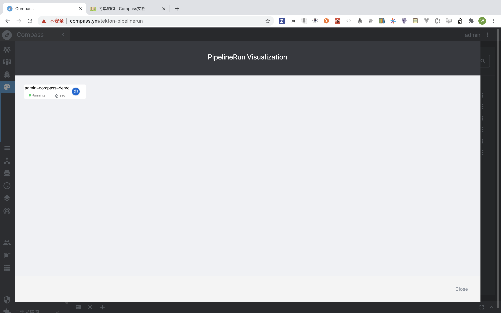

> 这里可以看到当前 pipeline 的任务的状态，时间。

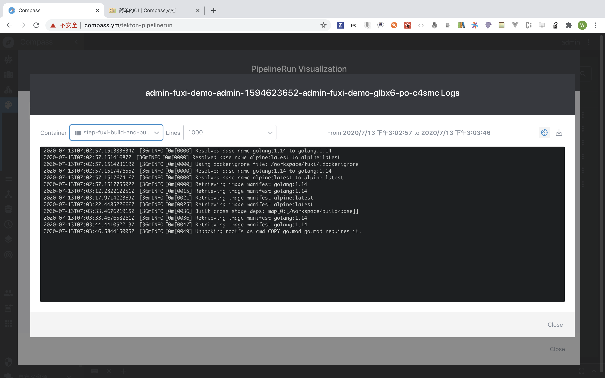

> 点击当前的 node。即可展示当前的日志。

Author:[withlin](https://github.com/withlin)
