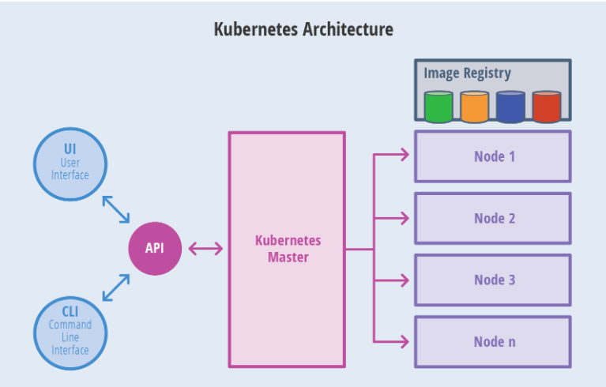
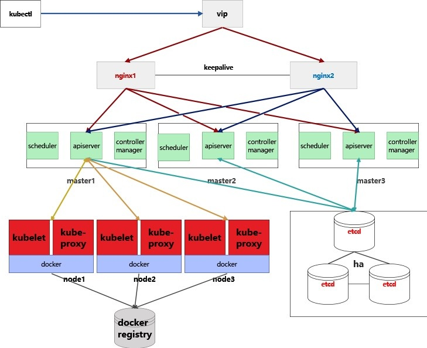
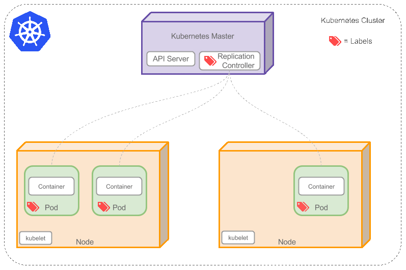

# Kubernetes 基本概念


## Docker容器概述
- 什么是Docker？

Docker是一个开源的应用容器引擎,让开发者可以打包他们的应用以及依赖包到一个可移植的容器中,然后发布到任何流行的操作系统上,也可以实现虚拟化,容器是完全使用沙箱机制,相互之间不会有任何接口.按现有的流行说法有两种方式来看待Docker.第一种方法是将Docker容器视为真正的轻量级虚拟机.第二种方法是将Docker作为软件打包和交付平台,后一种方法实践证明对开发人员日常部署更有帮助,所以被广泛的采用.

- 虚拟机与Docker

传统的部署是使用虚拟机将正在运行的应用程序隔离.物理机为虚拟机操作系统提供虚拟CPU、内存和其他资源,每个虚拟机就好像它是在实际的物理机运行一样, VMware是第一个普及这一概念的公司之一.但是,这种虚拟化有几个问题.首先,资源的提供需要时间.每一个虚拟磁盘镜像都是大而笨重的,准备好一个虚拟机使用需要的时间比较长! 其次更重要的问题是系统资源利用效率低下.操作系统内核是控制狂,它们想要管理可以使用的内容和资源.因此,当客户操作系统认为可以使用2GB内存时,即使运行在该操作系统上的应用程序只使用其中的一半,它也会控制该内存.但是,当我们运行容器化Docker的应用程序时,虚拟化的是我们操作系统(标准库、包等)，而不是硬件.所以,您不再需要为虚拟机提供虚拟硬件,而是为应用程序提供虚拟操作系统.如有需要，也可以运行多个应用程序并对它们的资源利用率施加限制。

- Docker作为开发人员的工具

开发人员面临一个问题是,应用程序运行的生产环境与开发环境之间存在差异.举个例子,您的桌面上运行着Windows10,但想在服务器Ubuntu18.04部署应用程序.也许您正在使用Pythonv3.6编写应用程序,而Ubuntu服务器仍在Pythonv3.4版本上运行.从而导致版本差异化、不兼容等问题,所以我们使用Docker来减少这种复杂性.Docker可以安装在任何操作系统上,甚至支持Windows和Mac OS X.因此,您可以将代码打包到Docker映像中,使用Docker在本地运行和测试,以确保从该Docker镜像创建的容器在生产中的行为相同.注意：所有依赖项(如编程语言版本、标准库等)都包含在该镜像中. 例如在开发node.js时,开发人员也可以基于node的官方docker镜像之上构建自己的docker映像来运行程序.
## 为什么使用kubernetes
```
- Docker 的管理痛点:

Docker可以有效的解决环境的一致性问题,但不能解决大规模应用部署，如果想要将单机的Docker应用于庞大的业务实现,是存在困难的编排、管理和调度问题.于是,我们迫切需要一套容器管理系统,对Docker及容器进行更高级更灵活的管理,Kubernetes就是为更加高效管理Docker而产生的,下面将介绍下重点项目Kubernetes.

- Kubernetes与docker之间的共生关系:

Docker是一个独立的应用程序,可以安装在任何计算机上运行集装箱化的应用程序.容器化是一种在操作系统上运行应用程序的方法,使应用程序与系统的其余部分隔离.您为您的应用程序创建了一个错觉,即它获得了自己的操作系统实例,尽管同一个系统上可能运行着其他容器。Docker使我们能够在单个操作系统上运行、创建和管理容器.如果您在一组主机(不同的操作系统)上安装了Docker,则可以利用Kubernetes.这些节点或Docker主机可以是服务器或虚拟机.然后,Kubernetes允许您从单个命令行或仪表板跨所有这些节点自动化容器供应、联网、负载平衡、安全性和扩展.由单个kubernetes实例管理的节点集合称为kubernetes集群。

为什么首先需要多个节点？其背后的有两个原因：
1)使基础架构更加稳定—即使某些节点离线(即高可用性),您的应用程序也正常运行.
2)使应用程序更具可伸缩性—如果工作负载增加,只需生成更多容器或向Kubernetes集群添加更多节点.
Kubernetes自动化扩展,管理,更新和删除容器的过程.换句话说,它是一个容器编排平台.虽然Docker是集装箱化的核心,但Kubernetes使我们能够首先拥有集装箱.
- Kubernetes与docker之间的差异

原则上,Kubernetes可以使用任何容器化技术.Kubernetes可以集成的两个最流行的容器:rkt和Docker.但是,Docker的成熟度和稳定性赢得了最大的市场份额,这导致了Docker和Kubernetes之间的集成方面更加完善,比任何其他容器(集装箱)化技术支持得更好.
- Kubernetes与docker之间的相似点

1)可用于微服务的体系架构
2)两者都是开源项目。
3)主要用Go编写，允许它们作为小型轻量级二进制文件发布。
4)它们使用可读的YAML文件来指定应用程序堆栈及其部署。
从理论上讲,你可以直接了解Kubernetes,但在实践中,最好从一台机器上运行Docker的简单案例开始,然后逐渐了解Kubernetes是如何发挥作用的,那么您将更快掌握相应的技能并且受益更多。
下面让我们更深入地讨论这个话题……
```
## kubernetes功能

- 多租户网络隔离:
Kubernetes支持多种网络插件，如flannel,calico,canel等,每个插件都有独特的性能,可以分别适用于多种场景,我们可以利用calico的network policy(网络策略)解决k8s中的网络隔离,对于多租户场景,可以每一个用户一个名称空间(namespace),然后对这个名称空间设置网络隔离。

- 高可用高可扩展性:
kubernetes中支持多种高可用解决方案,如keepalive+nginx、keepalived+haproxy等,可以使访问流量分发到不同的主机节点,减轻节点压力,如果某个节>点出现故障,可以实现妙级切换,达到高可用,保证业务不中断。

## kubernetes特点

- 可移植:  支持公有云、私有云、混合云、多重云

- 可扩展:
可根据业务流量情况快速扩展kubernetes集群的节点数量。

- 自愈:
自动发布、自动重启、自动复制、自动扩展


## kubernetes优点

- 灵活部署
kubernetes支持在多种平台部署，可在私有云，公有云，混合云，openstack、openshift、VMware vSphere，VMware Workstation，虚拟机，物理机等环境部署。

- 安全高效，拥有完善的认证授权机制，自带审计功能
可以对多用户做细化的授权管理（如rbac授权），达到相互之间的操作完全隔离，互不影响，而且自身带有审计功能，可以对操作过程进行实时的日志记录，出现问题可以方便排查。

- 负载均衡
支持四层、七层负载均衡，可用于多种场景,例如nginx、LVS等传统负载软件。

- 可扩展性强
拥有强大的集群扩展能力，可以根据业务规模自动增加和缩减主机节点的数量，确保服务可以承受大量并发带来的压力，保证业务稳定运行。

- 根据节点资源的使用情况对pod进行合理的调度
可以按照用户需要调度pod，例如保证Pod只在资源足够的节点上运行，会尝试把同一功能的pod分散在不同的节点上，还会尝试平衡不同节点的资源使用率等。

- 拥有完善的灾备预警方案
拥有多种灾备解决方案，支持备份和容灾，出现故障可以达到秒级切换，保证线上业务不受影响；
## Kubernetes组件讲解


- master节点组件

```
apiserver
提供了资源操作的唯一入口,并提供认证、授权、访问控制、API注册和发现等机制,负责接收、解析、处理请求。
​ scheduler
调度器,负责资源的调度,按照预定的调度策略将Pod调度到相应的机器上。
​ kube-controller-manager
控制器,负责维护集群的状态,检查pod的健康状态,比如故障检测、自动扩展、滚动更新等一些操作；
​ etcd
etcd是一个key/value形式的键值存储,保存了整个kubernetes集群的状态,在kubernetes中使用etcd时,需要对etcd做备份,保证高可用,整个kubernetes系统中一共有两个服务需要用到etcd用来协同和存储配置,分别是：
1)网络插件calico,对于其它网络插件也需要用到etcd存储网络的配置信息 
2)kubernetes本身,包括各种对象的状态和元信息配置 
注意：网络插件操作etcd使用的是v2的API,而kubernetes操作etcd使用的v3的API
```

- node节点组件，工作节点组件

```
 kubelet
负责与master节点的apiserver进行通信的，接收到客户的请求，进行创建Pod，管理Pod，启动pod等相关操作

​ kube-proxy
k8s代理，是在群集中的每个节点上运行的网络代理，kube-proxy负责请求转发，一旦发现了某一个Service关联的Pod信息发生了改变（如IP、Port等），由Kube-Proxy就会把变化后的service转换成IPVS或IPtables规则中，完成对后端pod的负载均衡

```

- 附加组件

```
coredns
k8s1.11之前使用的是kubedns
1.11之后才有coredns
coredns是一个DNS服务器，能够为Kubernetes services提供DNS记录

​ dashboard
k8s的web界面，通过这个界面可以对k8s资源进行操作

​ Ingress Controller 
七层负载均衡控制器，可以创建nginx或者traefik这种七层负载应用，实现域名和https访问

​ prometheus+alertmanager+Grafana 
监控k8s集群和物理节点

​ elk 
采集pod和容器日志(Elasticsearch,Logstash,Kibana)
```

## kubernetes架构
- master一般是三个节点或者五个节点做高可用，根据集群规模来定，master高可用指的是对apiserver做高可用或者对master的物理节点做高可用

- node可以有多个节点，专门用来部署应用的。


## 关键词解释
- RC与Pod之间的关系,如下图

- Pod    篮子 
- container    装在篮子里的鸡蛋

- label selector (例如:蛋分类，鸡蛋，鸭蛋) 
  标签以key/value键值对的形式附加到各种对象上，如Pod、Service、RC、Node等。

- Deployment (主要职责同样是为了保证pod的数量和健康)
  Deployment为Pod和Replica Set（下一代Replication Controller）提供声明式更新

- Service  访问服务(对外暴露,主要代理人)   
  代理/负载均衡
- RC与Pod之间的关系,如下图


## kubernetes应用场景
- 通过kubernetes部署高效的日志管理系统: 

```
在生产环境中，日志对于排查问题至关重要，我们需要有一个日志管理系统，如efk这个最受欢迎的日志管理系统。kubernetes可以实现efk的快速部署和使用，通过statefulset控制器部署elasticsearch组件，es用来存储日志数据，还可通过动态volumeclaimtemplate动态生成pv实现es数据的持久化存储。通过deployment部署kibana组件，实现日志的可视化管理。通过daemonset控制器部署fluentd组件，来收集节点和k8s集群的日志。
kubernetes中部署efk可实现如下功能：
1）如果集群扩容，那么daemonset控制器会自动检测到新增加的node节点，就会在新的node节点上部署fluentd，完成日志收集，这就可以减少人为干预，提高工作效率，确保日志可以被正常收集。
2）如果es数据量大，kubernetes可以实现集群中pod应用的水平扩展，完成应用的弹性扩容和收缩等操作。

- kubernetes在DevOps场景下的应用: 

DevOps是一套完整的运维开发流程，可以实现快速的构建、测试和发布软件，整个流程包括敏捷开发->持续集成->持续交付->持续部署->DevOps，通过 Kubernetes，我们可以实现容器在多个计算节点上的统一调度，可以将容器对接到持久存储、虚拟网络，还可以实现弹性伸缩等，提高了产品的迭代速度。kubernetes在DevOps中可以实现如下功能：
1）多集群管理：
可以根据用户需求对开发，测试，生产环境部署多套kubernetes集群，每个环境使用独立的物理资源，相互之间避免影响。
2）多环境一致性：
Kubernetes是基于docker的容器编排工具，因为容器的镜像是不可变的，所以镜像把 OS、业务代码、运行环境、程序库、目录结构都包含在内，镜像保存在我们的私有镜像仓库，只要用户从我们提供的私有仓库拉取镜像，就能保证环境的一致性。
3）持续集成，持续部署，持续交付：
可以让产品快速迭代，自动部署，根据用户的要求达到持续交付的能力。
```
- kubernetes在微服务架构中的应用

```
微服务可以很好地保证未拆分的应用与已经拆分出来的微服务之间的互通和统一治理，不将业务代码与任何框架，平台或者服务绑定，管理微服务时，我们需要对这些微服务和它们的调用关系进行注册、为其分配资源、创建一定数量的节点副本、并发布到集群中去，同时还要为其配置好网络和负载均衡，使这些微服务能够被外部访问。在这些微服务的运行过程中，需要始终保持其可用性，一旦有节点出现问题，需要立即创建新的节点将其替换掉。运行过程中需要对这些微服务进行监控和日志收集，在负载发生变化的时候，还要能够迅速调整资源分配。
```
- kubernetes在微服务中可以实现如下功能：
```
服务发现：
通过service可以实现服务发现，支持4层和7层负载均衡，支持安全可靠的https协议和证书认证签发，可实现负载均衡，自修复，自动关联
2）提供统一的配置管理中心：
对于配置中心，K8S提供了configMap，可以在容器启动的时候，将配置注入到环境变量或者 Volume 里面。
3）弹性伸缩：
通过控制器创建指定数量的pod副本，通过hpa可以实现pod应用的水平扩容和回收
4）集群监控：
支持容器，集群和节点级别的监控，提供全面的监控指标，多途径的报警方式及可视化的监控报表
5）高质量的调度和故障恢复策略：
支持节点级别的亲和性调度，支持异地数据备份和故障恢复。
6）通过jenkins、Tekton实现持续集成/持续部署
保证集群服务高可用：
Jenkins Master和Jenkins Slave以Pod形式运行在Kubernetes集群的Node上，当Jenkins Master出现故障时，Kubernetes会自动创建一个新的Jenkins Master容器，并且将Volume分配给新创建的容器，保证数据不丢失，从而达到集群服务高可用。
动态伸缩：
合理使用资源，每次运行Job时，会自动创建一个Jenkins Slave，Job完成后，Slave自动注销并删除容器，资源自动释放，而且Kubernetes会根据æ个资源的使用情况，动态分配Slave到空闲的节点上创建，降低出现因某节点资源利用率高，还排队等待该节点的情况。
扩展性好：
当Kubernetes集群的资源严重不足而导致Job排队等待时，可以很容易的添加一个Kubernetes Node到集群中，从而实现扩展。
